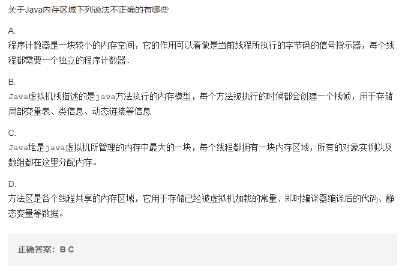
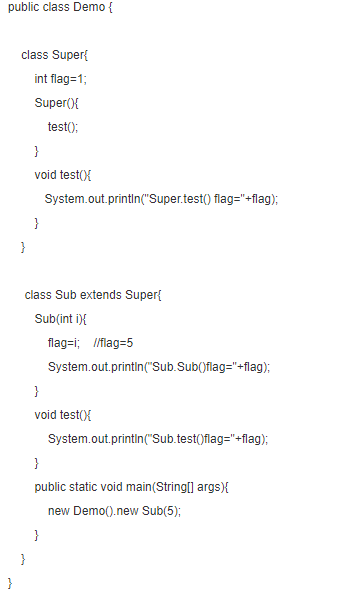
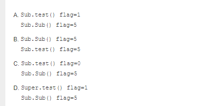
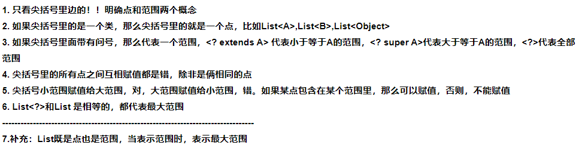
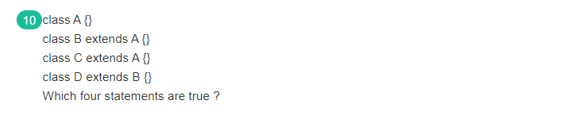
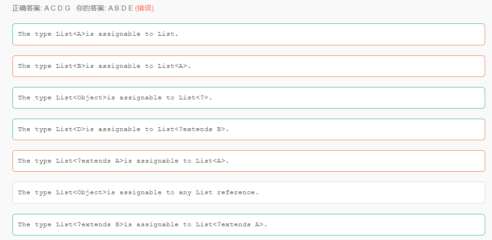
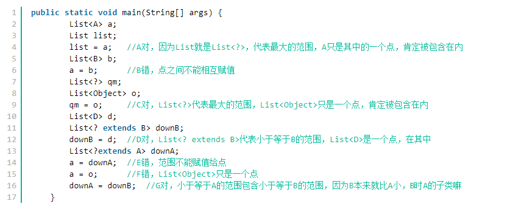
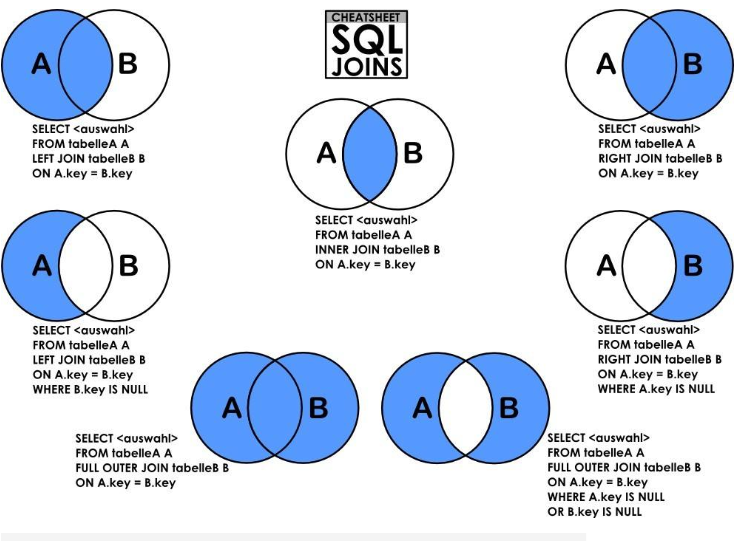
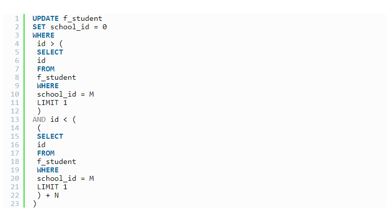
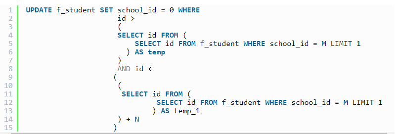

### 1、Java内存区域

 A.程序计数器是一块较小的内存空间，它的作用可以看做是当前线程所执行的字节码的信号指示器（偏移地址），Java编译过程中产生的字节码有点类似编译原理的指令，程序计数器的内存空间存储的是当前执行的字节码的偏移地址，每一个线程都有一个独立的程序计数器（**程序计数器的内存空间是线程私有的**），因为当执行语句时，改变的是程序计数器的内存空间，因此它不会发生内存溢出 **，并且程序计数器是jvm虚拟机规范中唯一一个没有规定 OutOfMemoryError 异常 的区域；** 

  B.java虚拟机栈：**线程私有**，生命周期和线程一致。描述的是 Java 方法执行的内存模型：每个方法在执行时都会创建一个栈帧(Stack Frame)用于存储**局部变量表、操作数栈、动态链接、方法出口等信息**。每一个方法从调用直至执行结束，就对应着一个栈帧从虚拟机栈中入栈到出栈的过程。 **没有类信息，类信息是在方法区中**

  C.java堆：对于绝大多数应用来说，这块区域是 JVM 所管理的内存中最大的一块。**线程共享**，主要是存放**对象实例和数组**

  D.方法区：属于**共享内存区域**，**存储已被虚拟机加载的类信息、常量、静态变量、即时编译器编译后的代码等数据**。



### 2、Java加载顺序

在继承中代码的执行顺序为：

​						  **1.类静态对象，父类静态代码块** 

​                          **2.子类静态对象，子类静态代码块、**

​                          **3.父类非静态对象，父类非静态代码块**

​                          **4.父类构造函数** 

​                          **5.子类非静态对象，子类非静态代码块**

​                          **6.子类构造函数**





对于本题来说：在只想**new** Sub(5)的时候，父类先初始化了 int flag = 1，然后执行父类的构造函数Super（），父类构造函数中执行的test（）方法，因子类是重写了test（）方法的，因此父类构造函数中的test（）方法实际执行的是子类的test（）方法，所以输出为Sub.test() flag=1，接着执行子类构造函数Sub(5) 将flag赋值为5，因此输出结果Sub.Sub() flag=5。最终选择了A。

### 3、泛型对应关系









点能赋值给范围，范围不能赋值给点。

### 3、Mysql多表连接查询以及更新操作



最近在处理一些数据库中数据的时候，写了下面的这一条sql语句:



上面的sql是想将某个区间的数据进行修改，但是放到测试环境下一跑，报下面的错误:

```
[Err] 1093 – You can't specify target table ‘f_student' for update in FROM clause
```

意思很显而易见了，说不能对进行查询操作的表进行update操作，也就说我们的where条件中进行了子查询，并且子查询也是针对需要进行update操作的表的，mysql不支持这种查询修改的方式。

**解决方法**

上网查了一下，针对这种问题可以通过”绕”的方式进行实现，下面看sql语句。



ok，完全没有问题。上面的sql相比于之前的sql只是在取id的时候绕了一下，通过一个子查询的方式获取到id,而不是直接进行获取。