# 技术报告

**袁子昂1**

>   1 北京邮电大学软件学院，北京，中国，100876

>   Email:yuanziang1997\@163.com

>   **摘要：**本报告用于记录研一期间通过课堂学习到的核心知识，重要的定理方法、理论延伸；以及通过阅读论文、书籍、观看网课、做项目等得到的重要技术方法。上述内容包括数理逻辑，数据库理论，UML，C++，数据分析，机器学习算法等。

**关键词：**记录；基础理论；技术方法；实验

引言
====

本报告分为基础理论，实验两大部分。基础理论包含数据库理论，软件管理，C++，UML等的一些疑难点，实验的每一项包括实验简介，实验方法，即用到的算法或技术，实验结果，最后得到结论。

基础理论
========

数据库理论
----------

### 一些知识

1.  Mysql建表时主键自动建成B树，好处是利于索引，但Insert时主键并非递增，会很耗时。

2.  外模式——VIEW

\|映像——逻辑独立性

模式——TABLE

>   \|映像——物理独立性

内模式——INDEX

### 索引和聚簇

索引即对一些（大于一就是复合索引）关键字建立B/B+树，当再次查询时即对B+树查询，时间复杂度O(h)。当树的叶子结点不仅仅存关键字和地址，而是把一行的数据都存放时，就称为聚簇。关键字一般就是主键，所以聚簇包含一个主键索引，也可以建立一些辅助键索引，辅助键索引的叶子结点data域存放的是对应的主键值，得到主键后再在主键索引里找到对应的叶子结点后直接在叶子节点中得到相应的属性。主键最好是自增id，这样叶子结点的顺序就是物理存放顺序。聚簇索引对范围查询的效率很高，因为数据是按大小排序的，调入内存一个页后，查询这个页中已存在的数据就不需要再次io操作。

C++及UML 
---------

### 浮点数在计算机中的存储形式

(2-1)

比如5.0在计算机中表示：

(2-2)

此时exp=129，XXX=25,S=0。

用图来表示：

S exp 2-1,2-2...

| 0 | 1000 0001 | 0100000000000 |
|---|-----------|---------------|

图2-1.浮点数5在计算机中表示

### 强制类型转换

大类型转小类型时，从低字节处取相应位数，因此可能会造成精度损失。注：C,C++无越界检查。

小类型转大类型时，从低字节处开始复制，剩余部分用0补齐。

### 指针

1.  通用形式的swap函数：size为指定交换类型字节数。

Void swap(void \*vp1,void \*vp2,int size){

char buffer[size];

memcpy(buffer,vp1,size);

memcpy(vp1,vp2,size);

memcpy(vp2,buffer,size);

}

例如：

char \*h=strduup(“fred”);

char \*w=strdup(“will”);

swap(&h,&w,sizeof(char \*));

1.  通用形式查找任何类型(指针数组不适用):

int research(void \*key,void \*base,int n,int elemsize){

for(int i=0;i\<n;i++){

void \*elemAddr=(char \*)base+i\*elemsize

if(memcmp(key,elemAddr,elemsize)==0)

return elemAddr;

else return NULL;

}

}

若是字符串数组查找，可设计比较函数：

Int strcmp(void \*vp1,void \*vp2){

Char \*s1=\*(char \*\*)vp1;

Char \*s2=\*(char \*\*)vp2;

Return strcmp(s1,s2);

}

### 通用数据结构

1.  编写通用栈:

typedef struct { void \*elems;

int elemsize ; int logLength ; int allocLength ;

} stack ;

void StackPush ( stack \*s , void \*elemAddr) { if ( s -\> logLength == s -\>
allocLength ) stackGrow ( s ) ;

void \*target = (char\*) s-\> elems + s-\> logLength \* s-\> elemsize; memcpy (
target , elemAddr , s-\>elemsize ); s -\> logLength ++; }

int StackPop(stack \*s , void \*elemAddr ) { void \*source = (char\*) s-\> elems
+ (s-\> logLength -1) \* s-\> elemsize); memcpy ( elemAddr , source,
s-\>elemsize); s-\>logLength--; }

1.  栈的改进:

如果栈中存的都是指针，而析构函数仅仅free(s-\>elem)，并不会释放指针指的空间，因此需要一个内置函数，指向用户自己编写的释放内存函数。

typedef struct {

void \*elems; //没指定类型,指向动态分配的存储空间

int elemsize; //每元素占多少字节

int logLength; //栈中有多少未知元素

int allocLength; //分配空间大小

void ( \*freefn ) ( void\* ); //指向用户的函数，如果不需要置为NULL

} stack;

此时析构函数变为：

void StackDispose ( stack \*s )

{ int i ;

if ( s-\>freefn != NULL )

{ for ( i = 0 ; i \< s-\>logLength ; i++ )

{

s-\>freefn ( (char\*) s-\>elems +i \* s-\>elemsize ) ;

}

}

free ( s-\>elems ) ;

}

假如用户需要释放的是字符串空间，他的freefn函数就是：

void Stringfree ( void \*elem )

{

free ( \*(char\*\*)elem );

}

### 函数指针

这里举了一个用函数指针完成long
long型用字符显示的例子，需要考虑到当数值为负值时，因为负数的取值范围比正数大1，取相反数有可能溢出的问题。

\#include\<stdio.h\>

using namespace std;

void printnum(long n,void(\*p)(char),void (\*q)(long n,void (\*p)(char)));

void printneg(long n,void (\*p)(char));

void aprintf(char a);

void aprintf(char a){

printf("%c",a);

}

void printneg(long n,void (\*p)(char)){//n总是负数

long q=n/10;

int r=-(n%10);

if(n\<=-10) printneg(q,p);

p("0123456789"[r]);

}

void printnum(long n,void(\*p)(char),void (\*q)(long n,void (\*p)(char))){

if(n\<0){

p('-');

q(n,p);

}

else{

q(-n,p);//正数的相反数总不会溢出，而负数的范围比正数大1，取相反数有可能溢出

}

}

int main(){

long long n;

scanf("%lld",\&n);

printnum(n,aprintf,printneg);

}

### 引用

引用起到指针的作用，可以对变量进行改变。可以直接定义一个引用类型的变量，给它赋值就是直接拿值给它。而且可以让函数返回引用类型，即返回了一个别名；但局部变量的引用不能返回，因为局部变量在栈区，用完就销毁了，它的别名也就没有意义了。函数返回的引用可以作为左值，为原变量赋新值。

### 拷贝构造函数

在以下情况中会调用构造函数：

1.定义并初始化一个对象时2.当一个对象被作为函数参数时3.当对象作为函数值返回时

### 析构函数

如同默认构造函数一样，如果一个类没有定义析构函数，编译器会自动生成一个默认析构函数，默认析构函数为空。用析构函数释放的空间是由构造函数分配，而不是由运算符new分配的。

### 类的聚合

原则：不仅要负责对本类中的基本类型成员数据赋初值，也要对对象成员初始化。

构造函数形式：

类名::类名(对象成员所需的形参，本类成员形参) :对象1(参数)，对象2(参数)，......{
本类初始化 }

### 多态

1.  运算符重载

声明形式：

函数类型 operator 运算符（形参）{
......}重载为类成员函数时：参数个数=原操作数个数-1（后置++、--除外）。重载为非成员函数时：参数个数=原操作数个数，且至少应该有一个自定义类型的形参。一个例子：

class Complex { //复数类定义public: //外部接口 Complex(double r = 0.0, double i
= 0.0) : real(r), image(i) { } //构造函数 Complex operator + (const Complex &c2)
const; //运算符+重载成员函数 Complex operator - (const Complex &c2) const;
//运算符-重载成员函数 void display() const; //输出复数private: //私有数据成员
double real; //复数实部 double image; //复数虚部}; Complex Complex::operator +
(const Complex &c2) const { //重载运算符函数实现 return Complex(real + c2.real,
image + c2.image); //创建一个临时无名对象作为返回值}Complex Complex::operator -
(const Complex &c2) const { //重载运算符函数实现 return Complex(real - c2.real,
image - c2.image); //创建一个临时无名对象作为返回值}

1.  虚函数

定义：如果类c1，c2…由基类base派生而来，base有一个用virtual修饰的公有或保护函数成员f()，而在c1，c2…中的一些类中重新定义了成员函数f()，而对f()的调用都是通过基类的对象或指针进行的，在程序执行时才决定是调用c1还是c2或其他派生类中定义的f()，这样的函数f()称为虚函数。虚函数是在基类中冠以关键字
virtual
的成员函数。它提供了一种接口界面。虚函数可以在一个或多个派生类中被重定义。

一个例子：

class base { public: virtual void who() {cout\<\<"I am base class\\n";}};class
firstderived: public base { public: void who() {cout\<\<"I am first derived
class\\n";}};class secondderived: public base { public: void who() {cout\<\<"I
am second derived class\\n";}};base base_obj;base \*p;firstderived
first_obj;secondderived
second_obj;p=\&base_obj;p-\>who();p=&first_obj;p-\>who();p=&second_obj;p-\>who();

### 继承

1.  公有继承

使得派生类的使用者能够访问基类的public和protected。

1.  保护继承

基类的public和protected成员都以protected身份出现在派生类中，但基类的private成员不可直接访问。

1.  私有继承

由私有派生得到的派生类,对它的基类的公有成员只能是私有继承。也就是说基类的所有公有成员都只能成为私有派生类的私有成员,这些私有成员只能被派生类的成员函数访问而派生类的使用者无权访问。

1.  构造函数执行顺序

先祖先(基类)，再客人(对象成员)，后自己(派生类本身)。

区块链技术[1]
-------------

### 一些概念的理解

1.  比特币：一种区块链的实现，一种数字货币。能够抛弃诸如银行这样的第三方介入而进行段对端交易，而且绝对安全，可靠。

2.  挖矿：不同与人民币由央行发行，比特币由挖矿产生。挖矿其实就是比赛解决一个数学问题，算得快的人得到新币加以鼓励。在这个过程中，每个矿工都用他的算力在验证和记录交易。相当于将央行货币发行和结算的任务分配给了每一个参加挖矿比赛的人，这就是“分布式”计算。

>   挖矿的过程是将过去一段时间的交易记录打包成一个区块，这个过程需要哈希加密算法去处理，所有矿工都在比赛谁的速度快，算力高，最终有一个人赢得了记账的权利，即把新块加入到总账中，而且他可以获得新币奖励。

1.  去中心化：没有像淘宝这样的中央机构去管理交易，而是直接打给你，但也不怕你抵赖，因为在交易发生的时候全网无数的账本都会共同记录下这笔交易。而这个同步的记录过程是分布式、去中心化的。

2.  私钥：比特币的地址相当于带锁的信箱，每个人的钱包可有多个信箱。私钥就好比这个锁唯一的钥匙。比特币地址是公开的，每个人都可以往这个地址发钱，但只有握有“私钥”的人才能打开用这个地址上锁的比特币。因为只要知道私钥就可以取走你的比特币，所以私钥一定要好好保管。

3.  交易过程：A给B付款0.1BTC的过程是这样的：A将要付B的0.1BTC用B的”专属地址“锁起来，然后向全网发送，相当于向所有人吼了一声：“我向能打开这把锁的人发送了0.1BTC”。
    B在网络中会马上收到这条信息，于是拿出私钥试试能不能打开这把锁。因为只有B钱包里的私钥才可以匹配这个地址，所以只有B能兑换这笔钱。

4.  记录交易过程：交易信息必须要被传送到比特币网络中，成为总账本的一部分。这个账本叫做区块链。一个“区块”里面记录了一段时间内的所有交易信息，“链”则是因为所有的历史数据块会一个个串联起来。

>   a.全网传播

>   比特币的账本是分布式的，网络中的每个节点都在帮助记账。A给B付款0.1BTC的时候，只需要向身边的节点大吼一声，收到信息的节点又迅速向自己的邻居发送这个消息。一传十十传百，只要几秒钟就能传遍整个网络。现在，所有人都知道"A给B付款0.1BTC"。

>   b.挖矿验证

>   这个交易在比特币网络上传播开来，但只有被矿工们“挖矿”验证并加到一个新区块中里，这个交易才会成为总账本的一部分。

1.  区块链技术：通俗一点说，区块链技术就指一种全民参与记账的方式。所有的系统背后都有一个数据库，你可以把数据库看成是就是一个大账本。那么谁来记这个账本就变得很重要。目前就是谁的系统谁来记账，微信的账本就是腾讯在记，淘宝的账本就是阿里在记。但现在区块链系统中，系统中的每个人都可以有机会参与记账。在一定时间段内如果有任何数据变化，系统中每个人都可以来进行记账，系统会评判这段时间内记账最快最好的人，把他记录的内容写到账本，并将这段时间内账本内容发给系统内所有的其他人进行备份。这样系统中的每个人都了一本完整的账本。这种方式，我们就称它为区块链技术。

### 哈希函数的三大特性

1.  要使哈希函数达到密码安全，要求有三个重要特性：（1）碰撞阻力。（2）隐秘性。（3）谜题友好。

2.  碰撞阻力：如果无法找到两个值，x和y，x!=y，而H(x)=H(y)，则称哈希函数H具有碰撞阻力。需要注意：我们实践中依赖的哈希函数仅仅是人们经过不懈努力之后暂未找到碰撞的函数，事实上，任何哈希函数都存在碰撞。因此，我们选择相信那些加密的哈希函数具有哈希阻力。

3.  隐秘性：哈希函数H具有隐秘性，如果：当其输入随机变量r选自一个高阶最小熵的概率分布，在给定H(r\|\|x)条件下来确定x是不可能的。

>   这里r选自高阶最小熵即无法（或极小可能）能预测到它的取值。\|\|指把变量连接起来。应用：承诺协议。Commit(msg,nonce):=H(nonce\|\|msg)。这样就保证了承诺协议的两个特性：已知输出值H(nonce\|\|msg)，找不到对应的承诺信息msg；没有办法找到两对(msg,nonce)和(msg’,nonce’)，msg!=msg’，而H(nonce\|\|msg)==H(nonce’\|\|msg’)。需要注意的是：对于每次的msg，你都需要选择新的随机值nonce。

1.  谜题友好：给定一个哈希函数H，再给一个从高阶最小熵分布选出的一个取值，id（称为谜题id），有一个目标集合y，该谜题的解决方法为一个解，x，使满足：H(id\|\|x)
    ∈
    Y。显然，Y的大小越小，谜题难度越大。因为谜题id取自高阶最小熵分布，因此求解无捷径。如果一个哈希函数满足了谜题友好特征，意味着对于这个谜题没有一个解决策略，比只是随机地尝试x的取值会更好。比特币采矿正是利用了这一特性的一个应用。

### 区块链技术栈

1.  区块链账本

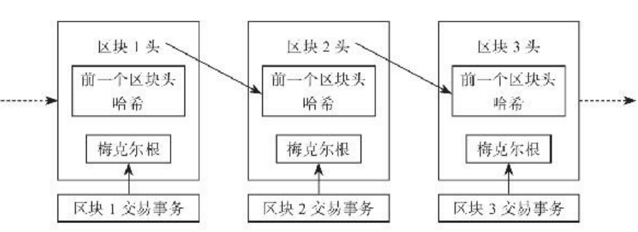

Figure 2-2 BlockChain

如图，区块分区块头和区块体，区块头中存储上一各区块的区块头hash，以及梅克尔根（可能还有其他）。梅克尔根是该区块所有交易的标识。

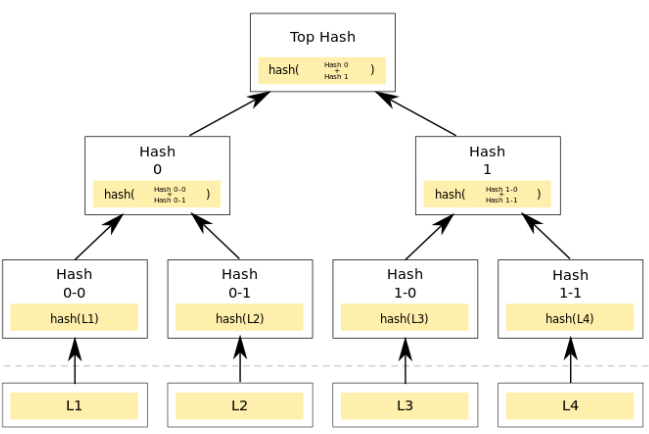

Figure 2-3 MerkleTree

在这里，最下面的Li是交易。通过两两计算hash得到父节点最后得到根节点即梅克尔根。

1.  共识算法

共识算法其实就是一个规则，每个节点都按照这个规则去确认各自的数据。我们暂且抛
开算法的原理，先来想一想在生活中我们会如何解决这样一个问题：假设一群人开会，这群
人中并没有一个领导或者说老大，大家各抒己见，那么最后如何统一出一个决定出来呢？实际处理的时候，我们一般会在某一个时间段中选出一个人来发表意见，那个人负责汇总大家
的内容，然后发布完整的意见，其他人投票表决，每个人都有机会来做汇总发表，最后谁的
支持者多就以谁的最终意见为准。这种思路其实就算是一种共识算法了。然而在实际过程
中，如果人数不多并且数量是确定的，那还好处理些，如果人数很多而且数量也不固定，那
我们就很难让每个人都去发表意见然后再来投票决定了，这样效率就太低了。我们需要通过
一种机制筛选出最有代表性的人，在共识算法中就是筛选出具有代表性的节点。
如何筛选呢？其实就是设置一组条件，就像我们筛选运动员，筛选尖子生一样，给一组
指标让大家来完成，谁能更好地完成指标，谁就能有机会被选上。在区块链系统中，存在着
多种这样的筛选方案，比如PoW（Proof of Work，工作量证明）、PoS（Proof of
Stake，权益证明）、DPoS（Delegate Proof of
Stake，委托权益证明）、PBFT（Practical Byzantine Fault
Tolerance，实用拜占庭容错算法）等，各种不同的算法，其实就是不同的游戏玩法，限
于篇幅，这里暂不进行算法过程的详述，大家只要知道这些都是一种筛选算法就行了。区块
链系统就是通过这种筛选算法或者说共识算法来使得网络中各个节点的账本数据达成一致的。

1.  脚本系统

脚本系统在区块链中是一个相对抽象的概念，也是极其重要的一个功能，可以说区块链
系统之所以能形成一个有价值的网络，依靠的就是脚本系统，它就像是发动机一样，驱动着区块链系统不断进行着各种数据的收发。所谓脚本，就是指一组程序规则。在区块链系统中，有些系统中的程序规则是固定的，比如在比特币系统中，只能进行比特币的发送与接
收，这个发送与接收的过程就是通过实现在比特币中的一组脚本程序来完成的；而有些系统
是允许用户自行编写一组程序规则的，编写好后可以部署到区块链账本中，这样就可以扩展
区块链系统的功能，比如以太坊就是通过实现一套可以自定义功能的脚本系统，进而实现了
智能合约的功能。
脚本系统使得在区块链中可以实现各种各样的业务功能。本来大家只是通过区块链来记财务账的，通过脚本系统，大家可以使用区块链来记录各种各样的数据，比如订单、众筹账
户、物流信息、供应链信息等，这些数据一旦可以记录到区块链上，那么区块链的优点就能
够被充分地发挥出来。

1.  网路路由

网络路由分两块：发现节点和数据同步。

每个节点向周围主动发送或被动接受一些其他节点的ip地址消息，如此反复传播，并通过一些协议来达到发现节点的功能。

除了要发现节点外，更重要的一个功能就是同步数据。节点要保持自己的账本数据是最
新的，就必须要时时更新自己的数据。从哪更新呢？既然没有服务器来下载，那就是通过邻近的节点了。通过向邻近节点发送数据请求来获得最新的数据，节点彼此都充当服务者和被服务者，通过这种方式，网络中的每一个节点都会在某一个时刻达成数据上的一致。最多节点相同的信息被认为是标准区块信息。

### UXTO

即未花费输出。在比特币中，没有余额这一概念，只有一笔笔的input和output，当想通过一个地址消费时，就检查之前的未消费的该地址的output，每个output相当于一些纸币，你可以组合起来去给另一个或几个地址输出，如果消费不完，就在相应交易的output部分加上自己地址这一条，相当于找零。当需要交易时，就把合起来后的钱拿出一部分，用目标地址的公钥加密，向全网广播，但是只有拥有该公钥对应的私钥的地址才能解锁，也就是私钥签名。

### 签名与验签，解锁脚本和锁定脚本

当一个用户需要创建一笔交易，需要写入输入信息，即引入的每一笔uxto的源txid，vout(上一笔交易中output的序号)，还需要写入输出，即每一笔发出的value，vout，和每个out的锁定脚本。锁定脚本包括一系列堆栈操作以及收款用户的公钥哈希，可以通过收款人的地址解码得到。所有信息准备完毕，只差签名了，签名即产生解锁脚本的过程，解锁脚本包括该用户的公钥和签名。公钥可以直接得到，而签名是由椭圆曲线加密算法得到。假设现在已经得到该解锁脚本，就写在该交易的input中，等待矿工验证。验证签名的过程其实就是利用解锁脚本解锁每个锁定脚本的过程，如果解锁成功，说明两个事情：1是每个Input的uxto确实属于该用户，确实是其他人发给该用户的。2是确认该交易确是该用户发起的，而且没有被修改过。下面先来说1的验证过程。锁定脚本的内容如下：

\<sig\>\<PubK(B)\>OP_DUPOP_HAS H160\<PubKHash(B)\> OP_EQUALVERIFY
OP_CHECKSIG。其实是一个堆栈的操作：

1. \<sig\>                                \<sig\> 入栈。

2. \<PubK(B)\>                       \<PubK(B)\>入栈。

3. OP_DUP                          复制位于栈顶的\<PubK(B)\> ,将副本置于栈顶。

4. OP_HASH160                 
对位于栈顶的\<PubK(B)\>副本进行HASH160,\<PubK(B)\>转变为\<PubKHash(B)\>。

5. \<PubKHash(B)\>              \<PubKHash(B)\>入栈

6. OP_EQUALVERIFY       
 比较位于栈顶的两个元素是否相同，若相同则移除这两个元素，继续执行。若不同，则中断执行，返回失败。

7. OP_CHECKSIG             
 检查签名（注意栈内现有的元素为\<sig\>\<PubK(B)\>）,根据结果返回成功或失败。

1-6的过程完成了1的验证，B的公钥哈希来自于上一笔交易的锁定脚本，即上一个用户用B的地址解码生成的。对B在本次交易解锁脚本中提供的公钥进行hash160操作，得到的值和公钥哈希对比，如果相同，就证明B确有这笔uxto。对于7的验证其实蕴含了椭圆曲线加密算法。这里简要介绍用该算法进行签名和验签的过程。

签名过程：

1、根据ECC算法随机生成一个密钥对(k, R), R=(xR, yR)

2、令 r = xR mod n，如果r = 0，则返回步骤1

3、计算 H = Hash(M)

4、按照数据类型转换规则，将H转化为一个big endian的整数e

5、s = k\^-1 (e + rd) mod n，若s = 0, 则返回步骤1

6、输出的S =(r,s)即为签名。

验证过程：

1、 计算 H = Hash(M)

2、按照数据类型转换规则，将H转化为一个big endian的整数e

3、计算 u1 = es\^-1 mod n, u2 = rs\^-1 mod n

4、计算 R = (xR, yR) = u1G + u2Q, 如果R = 零点，则验证该签名无效

5、令 v = xR mod n

6、若 v == r，则签名有效，若 v ≠ r, 则签名无效。

从数学上可以证明，若 v == r，即可证明信息M的确为持有密钥对（d,
Q）的签名者所签署，且未被修改过。其中M是交易，d是签名者的私钥，S是签名，Q是签名者公钥。若验证成功，即完成了2的要求。此时，即可以把该交易发布到网络上，供矿工进行验证，矿工根据解锁脚本去解锁对应的锁定脚本，成功就证明该交易合法，矿工就会打包该交易或者加到自己的本地区块链上。

### POW与挖矿 

比特币是一个对等网络，每个节点都可以独立维护自己的数据副本，那么问
题就来了，怎么来保证彼此之间的数据一致呢？既然没有一个中心服务器，自然也就没有一
个传统意义上的权威数据来源了。这就得有一个约定的规则，大家共同按照这个规则来进行
竞争，谁竞争成功了谁就有数据的打包权，也就是记账权，打包完成后广播给别人，别人只
要验证一下有无问题即可，没有问题就存入到自己的数据文件中。这个思路不错，等于就是
大家来竞争临时中心服务器的资格，那么比特币中实行了一种什么样的规则呢？那就是被称
为工作量证明（Proof of Work，PoW）的一种算法，其实就是类似于掷骰子的一种游戏。比
如大家约定掷出一个10位长度的数字，前面6位要都是0，后面的4位数得小于某个值，看谁
先掷出符合要求的数字出来，谁就抢得了打包权（记账权）。

1.  难度值

在比特币软件中，规定一个256位的整数：
x00000000FFFFFFFFFFFFFFFFFFFFFFFFFFFFFFFFFFFFFFFFFFFFFFFFFFFFFFFF
作为难度1的目标值。在比特币诞生初期，当时的全网算力，大约需要10分钟左右的运
算能得到一个符合这个难度1要求的值，这也是我们常常说比特币网络每隔大约10分钟出一
个区块的来源。我们在查询创世区块（也就是0号区块）的信息时，可以看到当时的难度就
是1。那么，所谓符合这个难度为1的要求的值是什么意思呢？就是说通过工作量证明算法，
也就是比特币中的挖矿算法来计算出一个结果，这个结果要小于这个难度目标值，我们来看下0号区块的难度信息："nonce":
2083236893, "bits": "1d00ffff", "difficulty":
1。0号区块的难度值是1，nonce是一个随机数，是挖矿计算得到的一个数
字，这个等会儿再介绍，bits是用来存储难度的十六进制目标值的，这个难度目标值是存储在
区块的头部的，在源码中被定义为一个4字节长度的字段，4字节也就是32位，要用来存储
256位长度的难度目标值，因此这256位长度的值需要经过压缩处理后才能放到这个字段中。可以压缩，也可以还原。以这个0x1D00FFFF为例来说明，系数是后面6位也就是00FFFF，指数是前面2位也
就是1D，代入进去就是：0x00FFFF\*2\^（8\*（0x1D-3）），计算后得到的值是：
0x00000000FFFF0000000000000000000000000000000000000000000000000000

这个跟规定的那个难度1的值不一样了，精度少了很多，存储在bits中的值是一个精度截断的近似值。
我们以200000号区块为例，查询一下难度值，得到如下：

"nonce": 4158183488, "bits": "1a05db8b", "difficulty": 2864140.507810974。

0号区块的难度是1，对应的目标值是
0x1D00FFFF，200000号区块的难度目标值是0x1A05DB8B，将两者的目标值按照上述公式进行转换后相除便能得到这个2864140.507810974的难度值，我们发现，200000号区块的
difficulty比0号区块的大许多，而bits的大小却比0号区块的小许多。这其实是表明了一个特点，随着全网算力越来越强，difficulty难度值就会越来越大，而bits表示的目标值会越来越
小，这两者成反比，目标值越小就越难挖矿。
刚才也提到了，难度值并不是一成不变的，比特币差不多每两周会调整一下新的难度
值，因为计算的算力是会变化的，为了维持差不多10分钟出一个区块的节奏，难度要跟随算力变化而调整。新难度值的计算公式是这样的：新难度目标值=当前难度目标值×（最近的2016个区块的实际出块时间/20160分钟）。2016个区块的意思是：假设按照理论的10分钟出一个块，2周也就是14天的时间，应该出2016个区块，可以看到实际上就是计算一下实际与理论上的时间差值，弥补上这个差值即可。

1.  挖矿计算

首先，我们说了
挖矿是要抢夺区块打包权，那就得收集需要打包进区块的那些交易事务，那这些数据从哪来呢？打包就像是记账，是把发生的交易事务记录下来存档，但是无论什么时候打包、谁打包，在网络中发生的交易是持续不断的，就像企业仓库的进销存业务，无论记账员是一个月还是半个月记一次账，业务是持续进行的。在比特币系统中，每个人都会将通过钱包进行的转账交易数据广播到网络中，这些都是属于等待打包的未确认交易数据。这些数据都会放在一个内存池中，总之就是一个缓冲区，当然，这些数据都会被接受基本的验证，用以判断是否是不合法的或者是不符合格式的交易数据。挖矿程序从内存池中获取用来打包区块的交易数据。在进行工作量证明之前，记账节点会做进行如下准备工作：

收集广播中还没有被记录账本的原始交易信息。

检查每个交易信息中付款地址有没有足够的余额。

验证交易是否有正确的签名。

把验证通过的交易信息进行打包记录。

添加一个奖励交易在区块的最前面：给自己的地址增加 12.5
比特币。接下来就开始进行挖矿了。看一下挖矿的计算公式： SHA256( SHA256(version +
prev_hash + merkle_root + ntime + nbits + nonce ) ) \< TARGET
SHA256是一种哈希算法，可以通过对一段数据进行计算后输出一个长度为256位的摘要信息。SHA256在比特币中使用很广泛，不但用于挖矿计算，也用于计算区块的哈希值和交
易事务的哈希值，比特币对SHA256算法是情有独钟啊，我们看到在这个公式中，是对参数
进行两次SHA256计算，如果计算出来的值小于那个TARGET（也就是难度目标值），那就算是挖矿成功了。算出来的值就作为区块头hash。

这些数据字段其实也是区块头的组成部分，将这些参数连接起来，参与SHA256的挖矿
计算。在这些参数中，版本号是固定的值，前一个区块的哈希值也是固定的值，当前难度也
是一个固定的值，那么要想改变这个公式的计算结果，能改动的参数就只有梅克尔根、区块时间戳和那个随机数了。

1）梅克尔根是通过交易事务计算出来的，挖矿程序从内存池中获取待打包的交易事
务，然后计算出梅克尔根，获取交易事务本身也是有一些优先级规则的，比如根据手续费大小之类，这些细节就不赘述了。

2）区块时间戳是指UNIX时间戳，用于记录区块的产生时间，我们知道比特币系统是分
布式的网络，没有固定的时间服务器，因此每个节点获得的时间戳都可能是不一样的，由
此，比特币系统中设置了规则：①新产生区块的时间戳要大于之前11个区块的平均时间戳；
②不超过当前网络时间2个小时。所以，后一个区块的时间戳比前一个区块的时间戳反而小
也是可能的。

3）随机数是一个可自由取值的数值，取值范围是0～2的32次方。
我们可以看到，要通过这样的参数来计算出符合条件的值，基本上也就只能靠暴力计算
匹配了，这种不断执行SHA256计算的过程很消耗算力，因此这个过程被形象地称为“挖矿”。简单地说，挖矿就是重复计算区块头的哈希值，不断修改该参数，直到与难度目标值匹配的一个过程。
一旦匹配成功，就可以广播一个新的区块，其他客户端会验证接收到的新区块是否合法，如果验证通过，就会写入到自己的区块链账本数据中。那么，挖矿的奖励在哪儿呢，这个奖励其实是作为一条交易事务包含在区块的交易事务中的，相当于系统给矿工转账了一笔比特币，
这种交易事务由于特殊性，通常称为coinbase交易，这个交易一般是位于区块中的第一条，
比特币系统也正是通过这种挖矿奖励的方式发行新的比特币，就像央行发行新钞一样。

1.  区块广播

矿工挖出区块后，就进行网络广播，传递给相邻的节点，节点接收到新的区块后会进行
一系列的验证，比如区块数据格式是否正确；区块头的哈希值小于目标难度；区块时间戳是否在允许范围之内；区块中第一个交易（且只有第一个）是coinbase交易；区块中的交易事务是否有效等：这个包括交易的发起人是否有该UXTO和该交易是否确实是发起人所发起，也就是验证签名，总之就是一连串的检测，全部校验通过就把新的区块数据纳入到自己的区块链账本中。如果是挖矿节点接收到信息，就会立即停止当前的挖矿计算，转而进行下一区块
的竞争。

1.  最长链选择

在3中，其实少说了一个要点：每个节点对区块链进行独立选择，在工作量证明机制下选择累计工作量最大的区块链。当有两名矿工在几乎在相同的时间内，各自都算得了工作量证明解，便立即传播自己的“获胜”区块到网络中，先是传播给邻近的节点而后传播到整个网络。每个收到有效区块的节点都会将其并入并延长区块链。当这个两个区块传播时，一些节点首先收到\#3458A,
一些节点首先收到\#3458B，这两个候选区块（通常这两个候选区块会包含几乎相同的交易）都是主链的延伸，分叉就会产生，这时分叉出有竞争关系的两条链，如图2-4：

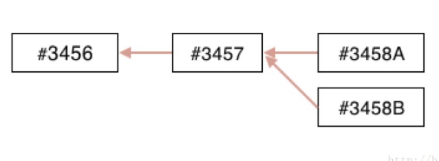

Figure 2-4 Furcation

两个块都收到的节点，会把其中有更多工作量的一条会继续作为主链，另一条作为备用链保存（保存是因为备用链将来可能会超过主链难度称为新主链）。收到\#3458A的（挖矿）节点，会立刻以这个区块为父区块来产生新的候选区块，并尝试寻找这个候选区块的工作量证明解。同样地，接受\#3458B区块的节点会以这个区块为链的顶点开始生成新块，延长这个链（下面称为B链）。这时总会有一方抢先发现工作量证明解并将其传播出去，假设以\#3458B为父区块的工作量证明首先解出，如图2-5：

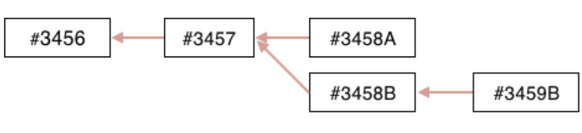

Figure 2-5 One branch is the first to solve

当原本以\#3458A为父区块求解的节点在收到\#3458B,
\#3459B之后，会立刻将B链作为主链（因为\#3458A为顶点的链已经不是最长链了）继续挖矿。节点也有可能先收到\#3459B，再收到\#3458B，收到\#3459B时，会被认为是“孤块“（因为还找不到\#3459B的父块\#3458B）保存在孤块池中，一旦收到父块\#3458B时，节点就会将孤块从孤块池中取出，并且连接到它的父区块，让它作为区块链的一部分。

比特币将区块间隔设计为10分钟，是在更快速的交易确认和更低的分叉概率间作出的妥协。更短的区块产生间隔会让交易确认更快地完成，也会导致更加频繁地区块链分叉。与之相对地，长的间隔会减少分叉数量，却会导致更长的确认时间。

### 钱包 

钱包，是属于比特币系统中的一个前端工具，其最基本的功能就是用来管理用户的比特
币地址、发起转账交易、查看交易记录等，在这方面与我们生活中使用的钱包是类似的。一开始的比特币钱包是跟比特币核心客户端一起发布的，这个钱包是比特币核心钱包，其使用过程必须要配合完整的区块链数据
副本，因此一般也只适合在桌面端使用。私钥与公钥来自公开密钥算法的概念，我们常说比特币是一种加密数字货币，之所以这
么说，是因为比特币的系统设计中巧妙地使用了现代加密算法，而其中一个运用就是生成比
特币地址，比特币地址的生成与公开密钥算法密切相关。什么叫公开密钥算法呢？传统的加
密算法，其加密和解密方法是对称的，比如凯撒密码，通过将字母移位来加密，比如字母a
替换成c，b替换成d，d替换成f这样，本来是abc的单词就变成了cdf，然而这种加密算法一旦
泄露，别人也就知道了解密算法，换句话说，只有一个密钥。针对这种问题，公开密钥算法
就应运而生，而公开密钥算法属于一种不对称加密算法，拥有两个密钥：一个是私钥，一个
是公钥。公钥可以公开给别人看到，私钥必须要妥善保存，使用私钥加密（通常习惯上将私
钥加密称为“私钥签名”）的数据可以用公钥解密，而使用公钥加密的数据可以用私钥解密，
两者是互相匹配的。目前使用比较广泛的公开密钥算法主要有RSA算法和椭圆曲线加密算法
（ECC），RSA是利用了素数分解难度的原理，ECC是利用了椭圆曲线离散对数的计算难
度，比特币中使用的是椭圆曲线加密算法。比特币地址，私钥，公钥，公钥哈希的生成如图2-5。

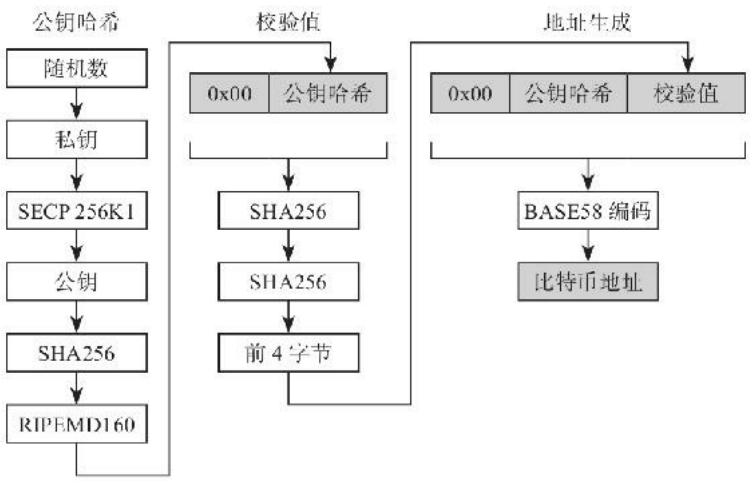

Figure 2-5 Address generation process

1.  首先使用随机数发生器生成一个私钥，私钥在比特币中的作用非常重要，可以用来
    证明用户的身份，也可以签发交易事务。

2.  私钥经过SECP256K1算法处理生成了公钥，SECP256K1是一种特定的椭圆曲线算
    法，需要注意的是，通过算法可以从私钥生成公钥，但是却无法反向从公钥生成私钥，这也
    是公钥为什么可以公开的原因。

3.  公钥接下来先使用SHA256哈希算法计算，再使用RIPEMD160哈希算法计算，计算出
    公钥哈希。比特币的代码通过2次哈希来计算地址值，这样能进一步确保哈希后的数值唯一
    性，进一步降低不同数据进行哈希后相同的概率。与SHA256一样，RIPEMD160也是一种哈
    希算法。

4.  将一个地址版本号连接到公钥哈希（比特币主网版本号为0x00），然后对其进行两
    次SHA256运算，将计算得到的结果取前面4字节作为公钥哈希的校验值。

5.  将0x00版本号与公钥哈希以及校验值连接起来，然后进行BASE58编码转换，最终得
    到了比特币地址。

所以，在比特币系统中，本质上并没有一个叫作“地址”的东西，因为“地址”是可以通过
公钥转化而来的，可以理解为公钥的另外一种形式，而公钥又是可以通过私钥计算出来的，
因此在比特币钱包中，真正需要妥善保存的是生成的私钥数据，这玩意可千万不能弄丢了，
一旦丢失，那可比忘记银行卡密码还麻烦。比特币钱包的主要功能就是保管私钥。

很多时候，我们在进行支付的时候，只是想通过一个支付验证，知道支付已经成功发起
就可以了。对于完整的交易验证（需要在完整的账本数据上校验，比如是否包含足够的余额，是否双花等）可以交给核心节点，这样就可以将钱包功能部分剥离出来，由此产生了
SPV钱包，事实上这个概念在比特币白皮书中就介绍过了，我们来看下它的原理是什么，
SPV钱包的大致过程如下所示。

1.  首先下载完整的区块头数据，注意是区块头，而不是所有的区块链数据，这样可以
    大大减少需要获取的账本数据量，区块头中包含有区块的梅克尔根，SPV方式主要就是靠它
    来实现的。

2.  如果想要验证某笔支付交易，则计算出这笔交易事务的哈希值txHash。

3.  找到txHash所在的区块，验证一下所在区块的区块头是否包含在账本数据中。

4.  获得所在区块中计算梅克尔根所需要的哈希值。

5.  计算出梅克尔根。

6.  若计算结果与所在区块的梅克尔根相等，则支付交易是存在的。

7.  根据该区块所处的高度位置，还可以确定该交易得到了多少个确认。

接下来我们再来介绍一种管理多个私钥的钱包技术，即分层确定性钱包（Hierarchical
Deterministic Wallets，有时也简称为HD
Wallets），简单地说，分层确定性钱包具有如下的特点。

1.  用一个随机数来生成根私钥，这与任何一个比特币钱包生成私钥没有区别；

2.  用一个确定的、不可逆的算法，基于根私钥生成任意数量的子私钥。
    比如比特币中使用的SHA256就是一个确定不可逆的算法，可以很容易使用SHA256设计
    出一个HD模型：SHA256（seed+n），这个就算是类型1确定性钱包了。实际上，分层确定性钱包是确定性钱包的一种，目前分层确定性钱包有Type1、Type2，还有BIP32规范几种类型，这些都是为了实现同一目的而制定的不同实现方法，基本原理都是类似的。所谓的分层，除了私钥由主私钥来生成逐层的私钥以外，公钥也一样，通过主公钥生成所有的子公钥。实际上，生成的密钥本身，都可以作为根来继续生成子密钥，这就是所谓的分层了。注意，这里通过公钥生成子公钥，不需要私钥的参与，无论是主私钥还是子私钥都不需要参与。示意图如图2-6：

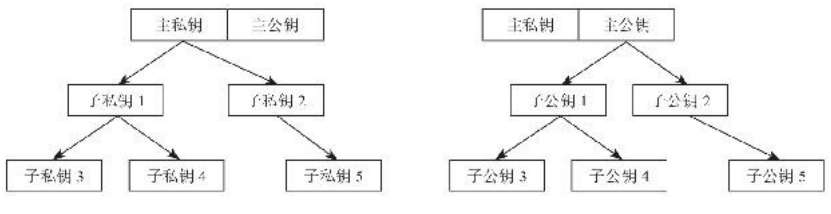

Figure 2-6 Sub-private keys and Sub-public keys

### 一致性问题与共识

1.  一致性问题

一致性要求分布式系统中每个节点产生同样的结果或者具备同样的状态，看
起来就好像是一台机器一样，前提是没有一个中心服务器作为调度员，这对于分布在互联网
上、不在同一个机房内、不属于同一个管理者的分布式系统来说，难度是很大的。出于系统
的可用性考虑，对于分布式系统来说，我们一般希望具备以下能力。
1）分布式系统作为一个逻辑整体，不应该返回错误的结果。
2）只要系统里的大部分机器工作正常，整个分布式系统就能有效运行，这也是分布式
系统应用的一个优点，抵抗单点故障。
3）系统的性能是可以横向扩展的，对于分布式系统来说，木桶原理不起作用。
4）分布式系统必须是异步的，也就是说每个节点可以按照自己的时序独立工作，没有
全序的时间顺序。
要达到这些要求，可是不容易呢！从生活中我们也可以发现，即便有统一的命令指挥，
尚且不一定能完全做到整齐划一，何况是没有这么一个指挥员呢！在互联网的场景中，任意
一个节点的状态，我们都是没法去强力管控的，比如比特币节点，谁能控制网络中的那些节
点呢！可能就是关闭了、断网了，甚至是一个恶意伪装的节点。一切看起来似乎无解。然而
实际上，很多时候我们对一致性的要求并没有那么迫切，在一定的约束下，可以实现所谓的
最终一致性，也就是说在某个时刻系统达到了一致的状态。这个节点现在断网了，没问题，
等恢复后跟上，通过其他节点来同步自己的数据；那个节点宕机了，也没问题，恢复后跟
上。只要整个网络中绝大部分的节点都是正常工作的，整个系统总能在未来的某一个时刻达
成数据状态的一致。

1.  FLP和CAP

1.FLP定理。定义：在网络可靠、存在节点失效（即使只
有一个）的最小化异步模型系统中，不存在一个可以解决一致性问题的确定性算法。在这个
原理的前提下，也告诉人们：不要浪费时间去为异步分布式系统设计在任意场景下都能实现
共识的算法，在允许节点失效的情况下，纯粹异步系统无法确保一致性在有限时间内完成。
这个其实也很好理解，比如三个人在不同房间回答问题，虽然三个人彼此之间是可以通
过电话沟通的，但是经常会有人时不时地开小差，比如Alice和Bob都回答了某个问题，Lily
收到了两者的回答结果，然后玩游戏去了，忘了回复，则三个人永远无法在有限时间内获得
最终一致的答复。这个定理在理论上证明了此路不通，也就节省了后来者的研究时间。

2.CAP定理。定义：分布式计算系统不可能同时确保一致性、可用性
和分区容错性，这三者不可兼得。通过定义我们可以知道，这是一个典型的不可能三角。那
么这三个术语具体是什么意思呢？含义如下。

一致性（consistency）：所有节点在同一时刻能够看到同样的数据，即“强一致性”。

可用性（availability）：确保每个请求都可以收到确定其是否成功的响应，并且是在有
限的时间内。

分区容错性（partition tolerance）：因为网络故障导致的系统分区不影响系统正常运
行，比如1号模块和2号模块不能使用了，但是3号和4号依然能提供服务。
直觉上的论证很简单：如果网络分成了两半，我在一半的网络中给A发送了10个币，在
另外一半的网络中给B发送了10个币，那么要么系统不可用，因为其中一笔交易或者全部两
笔都不会被处理，要么系统会变得没有一致性，因为一半的网络会完成第一笔交易，而另外
一半网络会完成第二笔交易。
既然不能同时满足，那么如果弱化对某个特性的支持呢？（1）弱化一致性
比如软件升级新版本后，过一段时间其他人才更新成功；再如网站更新内容后，浏览器
也是刷新后才显示更新内容。很多时候对于实时的强一致性并没有很高的要求，生活中也有
这样的例子：如果事情不那么紧急，就会发个短消息或者发个邮件，等对方看到了再处理；
如果紧急的话，就直接打电话，所以说电话是一种强连接方式，不过很多朋友肯定不喜欢时
不时地就有电话打进来吧。（2）弱化可用性
有些场合对一致性非常敏感，比如银行取款机，一旦系统故障就会拒绝服务，再如飞机上的控制系统，这个时候如果不能实时处理，那可是要命的。对计算机使用比较熟悉的朋友
都知道，很多服务器操作系统都是不带图形界面的，只能靠命令行来处理，因为服务器要提
高性能，保持可靠，会尽量避免加载不必要的模块，这也是一个牺牲可用性的例子。
（3）弱化分区容错性
对于分布式系统来说，分区容错是必然的，幸运的是这种情况出现的概率并不是很大。
如果真的是大规模的服务不可用，那无论是什么样的系统都是不能正常工作的。
计算机系统的设计，有时候跟生活中的场景是很类似的，你不得不做出一些妥协以便保
证自己最想要得到的结果。区块链系统中，尤其是公有链系统，使用各种共识算法，优先的
目的就是要保证整个系统的容错能力，这也是设计为分布式或者去中心结构的目的之一。

1.  拜占庭将军问题和用POW解决

拜占庭将军问题的经典描述是：拜占庭的军队是由小分队组成的，每个小分队由一个将军指挥，将军们通过传令兵来策划一系列的行动。有些将军是叛徒，他们会有意地妨碍忠诚的将军达成一致的计划（即进攻）。这个问题的目标是使忠诚的将军达成一致的计划，即使背叛的将军一直在诱使他们采用糟糕的计划。已经证明，如果背叛的将军超过了将军总数的1/3，达成上述目标是不可能的。特别要注意的是，要把拜占庭将军问题和两军问题区分开。两军问题的模型要比拜占庭将军问题简单，并且设立的前提场景也有差别，我们来看一幅示意图：

Figure 2-7 Two militaries problem

如上图所示，在此问题模型中，假设有两支对抗的军队（一支为A军，一支为B军），这
也就是所谓的两军。A军被B军隔开为两个部分，分别是左A军和右A军。从战斗力来说，A
军的两个部分必须同时合力进攻才能打败B军，这就要求A军的左右两支分队必须要协商好进
攻时间和一些进攻的其他约定，协商就意味着要通信，通过两边的互相通信来保持进攻指令
的一致性。那么问题来了，左右两边的A军要互相通信，就必须经过B军的区域，这就很难保
证通信是畅通的，两边必须要不断发送回执来确认对方是否收到了消息，很显然，从理论上
来讲，任何一次的回执都没法真正确认双方的消息接收是一致的。比如左A军发送了消息给右A军，右A军接收到了并且发送了确认回执给左A军，可是确认回执被B军阻截了，此时左
A军无法知道右A军到底收到消息没有，即便右A军的回执成功到达了左A军，可是若没有左
A军的回执（左A军的回执也可能被B军阻截），右A军同样无法确认左A军到底收到回执没
有。按照这种确认模式，只要有B军的阻截存在，左右两边A军就没法在理论上保证总是能达
成一致的消息确认。
我们可以看到，两军问题的关键点在于：两点之间的信道传输不可靠。我们日常使用的
大多数网络通信软件（支付、聊天、发送邮件等）其实都会面临这样的问题，通信过程发生
在互联网，谁也没法保证中间经过的“B军”是可靠的，一般也只能通过有限次数的双方回执
来确认消息的到达，这也是一个不得已的折中方案。值得注意的是，在这个问题模型中，并
没有去假设中间是否存在故意破坏者，也就是在两军的通信过程中，不考虑某一方可能叛变
的情况。回到拜占庭将军问题，其考虑的主要问题在于通信的各方（不一定是两军，也可能
是多军）存在故意破坏者或叛徒的情况下，大家如何来保持正确的一致性的问题。接下来用比特币的pow机制来试图解决拜占庭将军问题。

1、将军们出征前领一套相同的题目，这套题目有几百道题，一个一个排着序，每一道题都不简单，解出来需要花费一定的时间；

2、将军们到达各自的驻地后，如果有作战信息要发送给其他将军，就会派9个信使往其他9个将军那里各送一遍（类似于上面的1）；

3、每个将军都会收到一些其他将军的信息（不一定全），他们各自将自己收到的信息打包汇总，创建区块（类似于上面的2）；

4、每个将军开始解题，最开始是解第一道题，如果发现第一个区块已经上链，就解第二道，依此类推（类似于上面的3）；

5、如果某个将军解出题了，就将自己打包的信息和解题的答案发给其他将军（类似于上面的4）；

6、其他将军对答案和打包的信息进行验证（类似于上面的5）；

7、其他将军认可他的方法，就是在他的区块后面，继续工作予以延长（类似于上面的6）；

8、如果两个将军同时解出题了，冲突解决类似于上面的7。

这样，几个区块后，每个将军的指令都存储在区块链上了，也就是说，每个人都知道了其他人的想法，便可少数服从多数，统一行动，问题得解。

拜占庭将军问题里只要叛徒数量少于1/3就没问题。我们假设叛徒是3个，根据叛徒的作恶类型来看看效果：

1、叛徒发给其他将军的信息是“进攻”，但真正进攻时自己却不上。
假如3个叛徒都是发的进攻指令，如果剩下的7个将军里也有3个以上发的是进攻指令，那么就有6个进攻，少数服从多数，大家都会进攻。即使叛徒不进攻，也有7只军队进攻，仍然可以取胜；
假如3个叛徒都是发的“进攻”指令，如果剩下的7个将军里不足3人发的是进攻，那么达不到条件，大家都不动，也没啥问题。

2、叛徒发给部分将军的信息是“进攻”，给另一部分将军的信息是“不进攻”。
因为每个将军的信息都会上链，如果叛徒这样做的话，立马暴露。
当然，用比特币的玩法完全应用到这个场景是不完美的。比如说，如果有个叛徒将军解题特别厉害，也就是能发动51%攻击，那这套玩法就玩不转了，因为比特币系统有博弈机制，创建区块有奖励，这里没有。

1.  共识算法的目的

在有错误的进程存在并且有可能出现网络分区的情况下，FLP定理堵死了我们在传统计
算机算法体系下提出解决方案的可能性。计算机科学家就想，如果我们把FLP定理的设定放
松一点，问题是否有解呢？由社会学和博弈论中得到启发，科学家尝试引入了以下机制。

1）激励机制（incentive）。比如，在拜占庭将军问题中给忠诚的将军以奖励。当背叛的
将军发现背叛行为没有任何收益的时候，他们还有背叛的动机吗？这里引进了博弈论的概
念：我们不再把节点或者说将军分成公正/恶意（忠诚/背叛）两方，认为每一个节点的行为
是由激励机制决定的。正如两千年前中国诸子百家热烈争论的话题：人之初，性本善焉，性
本恶焉？我们认为，人之初，性无善无恶。性的善恶由后天的激励机制决定。如果激励机制
设置得当，考虑到每个节点都有最大化自己利益的倾向，大部分的节点都会遵守规则，成为
公正的节点。

2）随机性（randomness）。在拜占庭将军问题中，决定下一步行动需要将军们协调一
致，确定统一的下一步计划。在存在背叛将军的条件下，忠诚的将军的判断可能被误导。在传统的中心化系统中，由权威性大的将军做决定。在去中心化的系统中，研究者提出一种设想：是否能在所有的将军中，随机地指定一名将军作决定呢？这个有点异想天开的设想为解决拜占庭将军问题打开了一扇门。根据什么规则指定做决定的将军呢？对应到金融系统里，
就是如何决定谁有记账权。 1）根据每个节点（将军）的计算力（computing
power）来决定。谁的计算力强，解开
某个谜题，就可以获得记账权（在拜占庭将军问题里是指挥权）。这是比特币里用的PoW共识协议。2）根据每个节点（将军）具有的资源（stake）来决定。所用到的资源不能被垄断，谁
投入的资源多，谁就可以获得记账权。这是PoS共识协议。

出于上面的考虑，科学家引入共识算法，试图解决拜占庭将军问题。分布式共识协议具有以下两点属性：
1）如果所有公正节点达成共识，共识过程终止；
2）最后达成的共识必须是公正的。下面我们来谈谈共识算法的适用范围。区块链的组织方式一般有以下3种。

1）私有链：封闭生态的存储网络，所有节点都是可信任的，如某大型集团内部的多数
公司。

2）联盟链：半封闭生态的交易网络，存在对等的不信任节点，如行业内部的公司A、B、C等。

3）公有链：开放生态的交易网络，即所有人都可以参与交易，没有任何限制和资格审
核。由于私有链是封闭生态的存储网络，因此使用传统分布式一致性模型应该是最优的；由
于联盟行业链的半封闭、半开放特性，使用Delegated Proof
of×××是最优的；对于公有链，PoW应该是最优的选择。常见共识算法一览表：

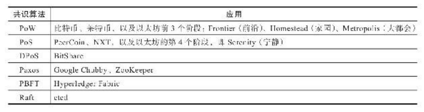

Figure 2-8 Common consensus algorithms

1.  Paxos算法

在这个算法模型中，使用到了如下的角色：

Figure 2-9 The characters of paxos algorithm

看到这些角色，有没有觉得很像现代的议会制度。Paxos正是这样的一个模型，当然在
计算机中这些所谓的“人”一般就是指节点，这些角色可以是不同的服务节点也可以是同一个
服务节点兼任。提案发出后，就要争取大多数的投票支持，当超过一半支持的时候，发送一
半结果给所有人进行确认，也就是说Paxos能保证在超过一半的正常节点存在时，系统达成
共识。提案过程还可以划分不同的场景，如下所示：

（1）单个提案者+多个接收者
这种情况下，一致性容易达成，或者说肯定能达成，因为只有一个提案，要么达成，要
么否决或者失败。但是这种情况下，这个唯一的提案者如果出故障，则整个系统就失效了。

（2）多个提案者+单个接收者
这种情况下也容易达成共识，对于接收者，选择一个作为决议即可，当然这种情况也属
于单点故障结构。

（3）多个提案者+多个接收者
这种情况，首先是避免了单点故障，但是问题也变得复杂了，既然提案和接收者都有多
个，那以哪个为准呢？并没有特别玄妙的办法，既然多个在一起不好解决，那还是得回到单
个提案者上去，只不过增加个规则选出那么一个单个提案者来，大致可以有如下的两个方
案：1）与第一种情况靠近，也就是想个办法选出一个提案者出来，约定在某一个时间段
内，只允许一个提案通过，可以设置一些竞争规则或者按照一个时间序列的排列选择，总之
最后会选出一个提案者。
2）与第二种情况靠近，允许有多个提案者，但是当节点收到多份提案后，通过某个规
则选出一份提案，也就是仍然保持只接收一份，规则可以有各种，比如根据提案序号排列或
者根据提案时间等。
实际上，在网络中，类似比特币这种，必然是属于多对多的这种情况，发送转账交易的
节点不止一个，矿工不止一个，接收区块进行验证的节点当然也不止一个，Paxos中为了解
决这样的问题，引入了称为“两阶段提交”的方案。所谓两阶段，就是“准备”和“提交”两个阶
段：准备阶段解决大家对哪个提案进行投票的问题，提交阶段解决确认最终值的问题。上述
这个过程中，可能会一直有新的提案出现，因此类似于比特币一样，分隔一下时间，比如每
隔10分钟打包一次，而打包者只能有一个。
在提交阶段，如果一个提案者在准备阶段接收到大多数节点的回复，则会发出确认消
息，如果再次收到大多数的回复，则保持原先的提案编号和内容；如果收到的消息中有更新
的提案，则替换为更新的提案内容；如果没有收到大多数的回复，则再次发出请求，等待其
他节点的回复确认。当接收者发现提案号与自己目前保留的一致，则对提案进行确认。
就个人的理解，这种做法如果是在一个相对私有的环境中或者网络环境比较好的情况
下，效果会比较明显，实际上，所谓的收到大多数的回应，这也是节点自身的一个评估，因
为节点并没有更好的办法去判断，到底算不算是大多数了，尤其是节点总数还不固定的情况下。

1.  Pos算法

股权权益证明（Proof of Stack，以下简称PoS）现在已经有了很多变种。最基本的概念
就是选择生成新的区块的机会应和股权的大小成比例。股权可以是投入的资金，也可以是预
先投入的其他资源。 PoS算法是针对PoW算法的缺点的改进。PoS由Quantum
Mechanic2011年在bitcointalk首
先提出，后经Peercoin和NXT以不同思路实现。PoS不像PoW那样，无论什么人，买了矿
机，下载了软件，就可以参与。PoS要求参与者预先放一些代币（利益）在区块链上，类似
将财产存储在银行，这种模式会根据你持有数字货币的量和时间，分配给你相应的利息。用
户只有将一些利益放进链里，相当于押金，用户才会更关注，做出的决定才会更理性。同时
也可以引入奖惩机制，使节点的运行更可控，同时更好地防止攻击。
PoS运作的机制大致如下。 1）加入PoS机制的都是持币人，成为验证者（validator）；
2）PoS算法在这些验证者里挑一个给予权利生成新的区块。挑选顺序依据持币的多少；
3）如果在一定时间内，没有生成区块，PoS则挑选下一个验证者，给予生成新区块的权
利；4）以此类推，以区块链中最长的链为准。
PoS和PoW有一个很大的区别：在PoS机制下，持币是有利息的。众所周知，比特币是有
数量限定的。由于有比特币丢失问题，整体上来说，比特币是减少的，也就是说比特币是一
个通缩的系统。在PoS模式下，引入了币龄的概念，每个币每天产生1币龄。比如你持有100
个币，总共持有了10天，那么，此时你的币龄就为1000，这个时候，如果你发现了一个PoS
区块，你的币龄就会被清空为0。你每被清空365币龄，你将会从区块中获得一定的利息。因
此，PoS机制下不会产生通缩的情况。
和PoW相比，PoS不需要为了生成新区块而大量的消耗电力，也一定程度上缩短了共识
达成的时间。但缺点是：PoS还是需要挖矿。

机器学习相关理论
----------------

### 监督学习和无监督学习

监督学习：数据集中每个样本都有对应的“正确答案”，再根据这些样本做出预测。监督学习包括回归和分类，回归即推出一个连续的输出，而分类是推出一组离散的结果。

1.  无监督学习：数据集每个样本都没有标签或者说只有同一种标签，从其中找到某种结构，分成不同的簇，这就是无监督学习的一种算法聚类，聚类算法非常常用，比如说谷歌新闻把同一主题的新闻分类到一起。无监督学习还有一个“鸡尾酒宴算法”，即通过几段音频的对比，把其中的每个声音线分类出来。

### 支持向量机（SVM）[2]

1.  软间隔最大化分类器

如果现在面对一个线性可分二分类模型，需要一个决策面将正负样本分开，而现实数据并非线性可分的，如果不加容错量，会使决策面发生震荡而无法收敛，或者即使收敛到一个非线性的决策面，也十分复杂，泛化能力低。因此需要软间隔变量去容忍一些错误，但需要为总的错误间隔加一个上限。

因此，现在的优化目标和约束是：

(2-3)

它的对偶问题是：

(2-4)

假设现在已经得到了一组最优解（后面会用SMO求解），它需要满足KKT条件：

(2-5)

g(x)是决策面函数，即wTx+b。

在这里，是将输入空间转到特征空间，在逻辑回归中需要将数据归一化。而在SVM中，为了解决非线性可分问题，将数据转到高维空间，就有可能去在高维去线性划分数据。但计算映射到高维空间，再计算内积，十分复杂，这里需要一个直接计算内积的方法：核函数。

1.  核函数

核函数的定义是：假设，原始输入空间X，新的特征空间是Z，如果存在一个X到Z的映射：

(2-6)

使得对所有的x1，x2属于X，函数K(x1,x2)满足条件：

(2-7)

则K(x1,x2)为一个核函数。核技巧的想法就是，在学习和预测中，仅仅定义K(x1.x2)，而不显示定义映射函数。

1.  SMO算法

前面是假设了一组最优解，现在要用SMO求解a\*，并利用它再去求w,b的最优解。

由于要优化N个变量，非常耗时甚至无法得到结果，SMO通过将大的优化问题转换成一系列的小优化问题，并且这些小问题的求解先后不影响最后的结果。由于有以下这个限制条件：

(2-8)

如果一次更新一个拉格朗日算子，其他固定的话，无法满足上式，所以一次选择两个算子更新，相当于一个变大另一个就变小，反之亦然。由于最优解是一定满足KKT条件的（充分必要），因此先选出一个不满足条件的出来，再尽量选一个使a2更新步长最大的项来更新，每次更新完算子，在基于KKT条件计算新的w和b。

先对含有核函数的对偶问题关于a2求导等0后，得到取极小值的点：

(2-9)

这里二次项系数一般是大于0的。又因为极值的取得需要在定义域上。因此还需讨论y1和y2同号异号时在[0,C]上不同的定义域得到两组L，H。异号时：

(2-10)

同号时：

(2-11)

因此，得到a2更新策略就是：

(2-12)

再由等式约束a1+a2恒定，得到a1的新值。现在就可以利用新的a2和a1，计算w和b。w好计算，即利用前面对w求偏导得0的等式。b利用当0\<a2\<C时的g(x2)t2=0得到。

循环直至全部变量都满足KKT条件，即得到了决策方程。

实验
====

实验1：使用k-近邻算法对约会网站对象匹配[1]
------------------------------------------

### 实验内容

利用三个特征，一个标签的1000大小数据集作为训练集，使用k-近邻得到分类器。抽出10%作为测试集检验分类效果，最后设计输入目标特征得到标签，并计算准确率。

### 算法概述

1.  计算已知类别数据集每个点到当前点距离；

2.  按照距离递增排序；

3.  选取距离最小的k个点；

4.  k个点中所在类别频率最多的即是当前预测分类。

>   关键代码如下：

>   def classify0(inX,dataSet,labels,k=1):

>   dataSetSize=dataSet.shape[0]

diffMax=np.tile(inX,(dataSetSize,1)) diff_1=(diffMax-dataSet)\*\*2

>   diff_2=diff_1.sum(1)

>   diff_3=diff_2\*\*0.5

>   dist=diff_3.argsort()

>   class1={}

>   for i in range(k):

voteLabel=labels[dist[i]] class1[voteLabel]=class1.get(voteLabel,0)+1

sorted_class=sorted(class1.items(),key=lambda x:x[1],reverse=True)

>   return sorted_class[0][0]

### 实验结果

如图3-1。

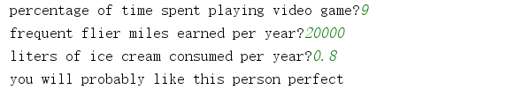

Figure 3-1 Knn-algorithm test result

实验2：利用决策树预测隐形眼镜类型[1]
------------------------------------

### 实验内容

搭建决策树模型，得到字典型数据。再利用字典建出基于plot的树状图。最后输入隐形眼镜数据集，得到字典数据和树状图，并预测患者的隐形眼镜分类。

### 算法概述

1.  对每个特征的分类结果计算一次熵，熵越小，说明基于该特征的分类结果越统一。并按照当前最优的属性进行数据集划分，形成新的集合。

2.  创建树使用递归程序，当仅剩一个类别时或者已经遍历完所有特征属性时return。下面每次拿到一个当前最优特征，并在特征名集合中删除当前特征，建立一个树字典，并在里面添加键为该特征名，值为一个内置字典。循环该特征的所有值作为内置字典的键，值是递归该程序得到的字典或分类结果，递归程序参数时基于该特征对应的值的划分子集。

3.  按比例建出树形图。

4.  代码略。

### 实验结果

如图3-2。

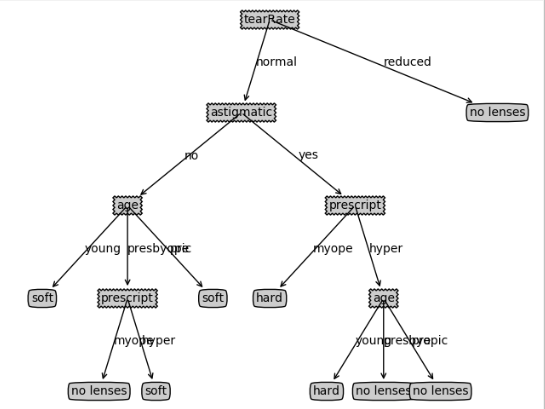

Figure 3-2 Classification decision tree for contact lenses

实验3：利用bloomfilter+MurmurHash检索字符串
-------------------------------------------

### 实验内容

处理对象是127w个单词的pattern.txt和98w单词的words.txt。利用布隆过滤器映射存储pattern单词，并检索words.txt的词是否在里面。这里Hash函数利用MurmurHash，初始化不同的种子得到不同的bit数组地址。

### 实验方法

1.  先根据数据量和预定错误率计算hash函数个数和bit数组大小，并初始化seeds数组。

2.  这里利用char数组模拟bit数组，通过hash函数得到地址后，用str[loc\>\>3]
    \|=(1\<\<(loc&0x7))按位或标1，并循环对所有得到的hash地址做相同操作。在查询时，得到每一个地址，并按为与检测是否都是1，如果有一个不是，就说明检索失败，否则检索成功。

3.  调小错误率到0.00009附近，可得到100%准确率，但内存耗费较严重。可舍弃一点错误率，得到较平衡的效果。

### 实验结果

如图3-3。

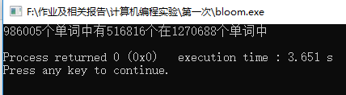

Figure 3-3 Words search result

实验4：利用朴素贝叶斯过滤垃圾邮件[1]
------------------------------------

### 实验内容

通过垃圾邮件数据集，随机取出90%作为训练集，其余作为测试集。通过训练集得到p0v,p1v和pa，输入测试集得到错误率。

### 算法概述

这里主要利用贝叶斯概率公式：

$$P\left( C_{i} \middle| W \right) = \frac{P\left( C_{i} \right)P\left( W
\middle| C_{i} \right)}{P\left( W_{j} \right)}$$ 

W代表某段文字，C代表某个类别，所以等式左边代表某段文字属于某一类的概率，通过计算所有类别的概率，概率最大的即为预测结果。等式右边的分母部分所有都一样不用比较，分子部分中P(Ci)代表这类所占比例，这很好得到。而另一部分仍是条件概率，这里我们假设文段中所有单词是同等重要且互相独立的，比如“我们”和“大家好”这两个词不是一个出现另一个就有概率出现的。虽然假设在现实中是不可能的，但这就是朴素贝叶斯中朴素的含义，而且得到的结果是令人满意的。因此，我们可以把条件概率拆成所有单词的条件概率的乘积，而这个是好得到的。我们只需要做出一个字典，并为每段文字都做一个关于这个字典的单词个数序列，通过统计得到所有单词条件概率。最后输入用户的单词个数序列对应相乘即可。

核心代码：

def trainNB0(trainMap,trainLabel):

numTrain=len(trainMap)

numWords=len(trainMap[0])

>   PA=sum(trainLabel)/float(numTrain)
>   P0Num=np.ones(numWords);P1Num=np.ones(numWords)

P0D=2.0;P1D=2.0;\#为了避免某个概率为0导致乘积也为0

for i in range(numTrain):

if trainLabel[i]==0:

P0Num+=trainMap[i]

P0D+=np.sum(trainMap[i])

else:

P1Num+=trainMap[i]

P1D+=np.sum(trainMap[i])

P1Vec=P1Num/P1D;P0Vec=P0Num/P0D

return
np.log(P0Vec),np.log(P1Vec),PA\#取对数是为了防止许多过小的数相乘导致下溢，取对数后单词的条件概率由相乘变成了相加，还不影响单调性

### 实验结果 

如图3-4。

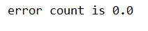

Figure 3-4 Spam classification accuracy rate reached 100%

实验5：利用Logistic回归对数据集画出决策边界[1]
----------------------------------------------

### 实验内容

给出一个测试集，包含两个特征，利用逻辑回归找到回归系数，并画出数据点和相应的决策边界。对比梯度下降和随机梯度下降的边界。

### 算法概述

我们现在要找到一个直线去对一些数据点进行拟合，设f(x)=wTx+b（线性）。为了计算简便，令$$x^{'}$$=$$\begin{bmatrix}
1 \\ x \\ \end{bmatrix}$$，$$w^{'}$$=$$\begin{bmatrix} b \\ w \\
\end{bmatrix}$$，此时f(x)=wTx。逻辑回归是预测为某类的概率，并设置一个阈值0.5，超过就判定为是，否则就不是。但f值域为无穷，显然不符合概率为[0,1]的要求，我们给f套上sigmoid函数，就得到了概率。即：

$$p = \sigma\left( f\left( x \right) \right) = \frac{1}{1 + e^{- w^{T}x}}$$


此时，p\>=0.5代表y=1，否则y=0。根据sigmoid函数，也就对应f(x)\>=0判定y=1，否则y=0。这里的f(x)也可以是非线性的。

p代表y=1的概率，则1-p代表y=0的概率。现在把两种概率统一起来，令P(yi\|xi)=pyi \*
(1-p)(1-yi) 。

数据集输入时，该条件概率是关于w的函数，其余都已知。显然应越趋于1越好，如果我们采集到N个数据点，{(x1,y1),…(xN,yN)}，事件发生的总概率即他们累乘，但由于连乘计算量很大，我们对连乘结果取对数，得到：

(3-2)

F(w)即是损失函数，由前面的推断，也可以由极大似然估计得到：我们希望它越大越好。因此我们需要找到一个w\*=argmax(F(w))，这里采用用梯度上升算法更新得到。求出F(w)梯度，并设置一个步长，就可以更新w了。经过计算（省略），梯度是：

(3-3)

因为F是一个连续的凸函数，所以存在最优点，而不存在局部最优，因此能用梯度算法。梯度上升(下降)公式为：

(3-4)

但每次更新都用上全部数据集，对于数据量大的情况，非常费时。因此用改进的随机梯度上升算法，每次都随机挑出一个数据点用于计算梯度，而且步长不是不变的，随循环而减小，这样既保证了能够快速收敛，减少w周期性波动，还能减小由于不可划分的数据点造成的稳定后的周期波动。

核心代码1：梯度上升

def
gradAscent(inX,inY):\#都转成矩阵形式，一是为了矩阵乘法方便，二是array单提出一行变成(m,)形状

inX=np.mat(inX)

inY=np.mat(inY).T

n,m=np.shape(inX)

alpth=0.001

maxCycle=500

weight=np.ones((m,1))

for i in range(maxCycle):

error=inY-sigmoid(inX\*weight)

weight=weight+alpth\*(inX.T\*error)

return weight

核心代码2：改进的随机梯度上升

def gradAscent1(inX,inY,num=200):

inX=np.mat(inX)

inY=np.mat(inY).T

n,m=np.shape(inX)

weight=np.mat(np.ones((m,1)))

for j in range(num):

for i in range(n):

index=random.randint(0,n-1-i)

alpha=4/(1.0+j+i)+0.01

error = inY[index] - sigmoid(inX[index] \* weight)

weight = weight + alpha \* (error \* inX[index]).T

return weight

### 实验结果

如图3-5，3-6，分别是梯度上升和改进版

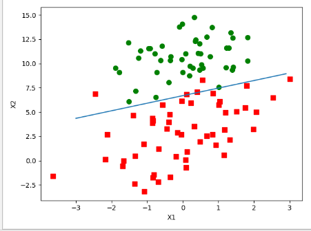

Figure 3-5 Decision boundary 1

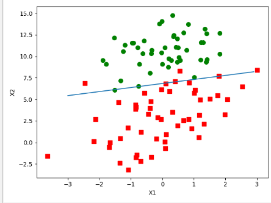

Figure 3-6 Decision boundary 2

实验6：创建平衡二叉排序树
-------------------------

### 实验内容

完成AVL树的插入，检索功能。最后做一个字符串简单地查找操作。

### 算法概述 

AVL树插入后需要维护平衡，具体有LL，LR，RR，RL四种旋转方式，判断是否平衡需要计算平衡因子，从插入点的父节点找起，找到哪个节点不平衡就旋转。核心代码如下：

RR：

void RotateRight(BiTree \*parent,BiTree \*T){

LNode \*x=(\*parent)-\>parent;

LNode \*subL=(\*parent)-\>lchild;

LNode \*subLR=subL-\>rchild;

(\*parent)-\>lchild=subLR;

if(subLR){

subLR-\>parent=(\*parent);

}

subL-\>rchild=(\*parent);

(\*parent)-\>parent=subL;

if(!x){

(\*T)=subL;

subL-\>parent=NULL;

}

else{

if(x-\>lchild==(\*parent)){

x-\>lchild=subL;

subL-\>parent=x;

}

else{

x-\>rchild=subL;

subL-\>parent=x;

}}}

LR：

void RotateLR(BiTree \*parent,BiTree \*T){

RotateLeft(\&((\*parent)-\>lchild),T);

RotateRight(parent,T);

}

计算平衡因子

void Calbalance(BiTree T){

if(T==NULL){

return;

}

T-\>bal=Height(T-\>rchild)-Height(T-\>lchild);

Calbalance(T-\>lchild);

Calbalance(T-\>rchild);

}

找到不平衡点

void InsertBalance(BiTree \*x,BiTree \*T){

if((\*x)==NULL) return;

LNode \*parent=(\*x)-\>parent;

while(parent!=NULL){

if(parent-\>bal==0){

break;

}

if(parent-\>bal\<-1){

if(parent-\>lchild-\>bal==-1){ RotateRight(\&parent,T);

}

else{

RotateLR(\&parent,T);

}

break;

}

if(parent-\>bal\>1){

if(parent-\>rchild-\>bal==1){

RotateLeft(\&parent,T);

}

else{

RotateRL(\&parent,T);

}

break;

}

parent=parent-\>parent;

}}

### 实验结果

如图3-7。

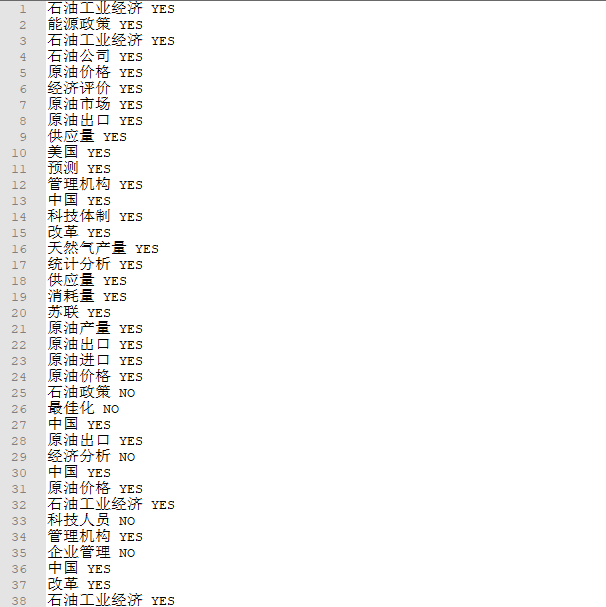

Figure 3-7 String search result

实验7：利用线性回归画出拟合线（两种算法实现）[1]
------------------------------------------------

### 实验内容

利用200个数据点，一个特征的数据集建立线性回归模型，画出拟合线。

### 算法概述

先得到假设函数，即拟合线，进而得到代价函数：这里利用平方误差函数。要使代价函数最小，这里采用两种算法：梯度下降和最小二乘。

假设函数：



设定代价函数是平方误差函数，线性回归的代价函数一定是凸函数，即它不存在局部最优解，只有一个全局最优解，也就避免了初始点选择的不同导致产生不同的最优解。代价函数是：

3-6

若采用批量梯度下降算法，求偏导后得到更新策略是：

3-7)

3-9

这里在训练集中加上一列X0，令这列值等于1用于匹配截距项。此时(10),(11)两式就可以合为(11)一个式子。更新公式用一个就能表达。因为m和a都是常量，此时也可以省略1/m。

1.  若采用普通最小二乘法：

不看系数1/m，代价函数可以写

(3-10)

展开得到：

(3-11)

对W求偏导得到（这里用到矩阵求导的公式）：

(3-12)

令它等于0，即求极小点，因为线性回归的代价函数是连续的凹函数，只有一个极小点，也就是最小点，因此可以解得我们要的w：

(3-13)

但此时需要XTX可逆。若不可逆，不能用这个方法。

核心代码1（梯度下降）：

def standRegres2(inX,inY,times=200):

X=np.mat(inX);Y=np.mat(inY).T

w=np.ones((X.shape[1],1))

a=0.001

for i in range(times):

error=X\*w-Y

w=w-a\*X.T\*error

return w

核心代码2（普通最小二乘）：

def standRegres1(inX,inY):

X=np.mat(inX);Y=np.mat(inY).T

XTX=X.T\*X

if np.linalg.det(XTX)==0.0:

print("false")

return

result=XTX.I\*(X.T\*Y)

return result

### 实验结果

如图3-8,3-9。

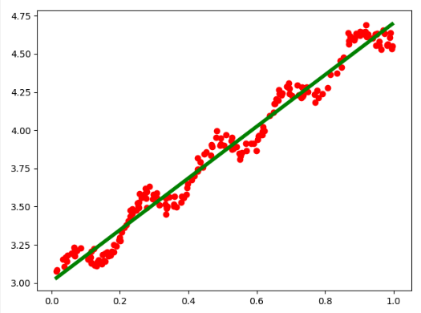

Figure 3-8 Linear regression fitting line1

[./media/image43.png](./media/image43.png)
==========================================

Figure 3-9 Linear regression fitting line2

实验8：SVM实验1-简化SMO[1] 
---------------------------

### 实验内容

针对100个数据点，2个特征的数据集进行二分类，画出决策边界，并标出支持向量。

### 算法概述

这里利用简易SMO算法，采用不加核函数的软间隔最大化分类器，具体算法原理见2.4.2中的理论。训练算法的代码如下：

def svmSimple(dataMat,classLable,C,toler,maxIter):

dataMat=np.mat(dataMat)

lableMat=np.mat(classLable).T

b=0;m,n=np.shape(dataMat)

alpha=np.mat(np.zeros((m,1)))

iter=0

while iter\<maxIter:

alphachanged=0

for i in range(m):

>   fxi=float((np.multiply(alpha,lableMat).T)\*(dataMat\*dataMat[i].T))+b

Ei=fxi-float(lableMat[i])

if ( (float(lableMat[i])\*Ei\<-toler)and(float(alpha[i])\<C ) )or(
(float(lableMat[i])\*Ei\>toler)and(alpha[i]\>0) ):

j=selectJrand(i,m)

>   fxj=float((np.multiply(alpha,lableMat).T)\*(dataMat\*dataMat[j].T))+b

Ej=fxj-float(lableMat[j])

aiold=alpha[i].copy()

ajold=alpha[j].copy()

if lableMat[i]!=lableMat[j]:

L=max(0,alpha[j]-alpha[i])

H=min(C,C+alpha[j]-alpha[i])

else:

L = max(0, alpha[j] + alpha[i]-C)

H = min(C, alpha[j] + alpha[i])

if L==H:

print("L==H");continue

eta=-(2.0\*dataMat[i]\*dataMat[j].T)+(dataMat[i]\*dataMat[i].T)+(dataMat[j]\*dataMat[j].T)

if eta\<=0:

print("eta\<=0");continue

alpha[j]+=lableMat[j]\*(Ei-Ej)/eta

alpha[j]=clipAloha(alpha[j],H,L)

if abs(alpha[j]-ajold\<0.00001):

print("j not moving enough");continue

>   alpha[i]+=lableMat[j]\*lableMat[i]\*(ajold-alpha[j])

b1=b-Ei-float(lableMat[i]\*(alpha[i]-aiold)\*(dataMat[i]\*dataMat[i].T)-lableMat[j]\*

(alpha[j]-ajold)\*(dataMat[i]\*dataMat[j].T))

b2 = b - Ej - float(lableMat[i] \* (alpha[i] - aiold) \* (dataMat[i] \*
dataMat[j].T) - lableMat[j] \*

(alpha[j] - ajold) \* (dataMat[j] \* dataMat[j].T))

if (alpha[i]\>0)and(alpha[i]\<C):

b=b1

elif (alpha[j]\>0)and(alpha[j]\<C):

b=b2

else:

b=(b1+b2)/2.0

alphachanged+=1

>   print("iter: {} i: {} , pairs changed {}".format(iter,i,alphachanged))

if alphachanged==0:

iter+=1

else:

iter=0

print("iter number : {}".format(iter))

w=np.multiply(alpha,lableMat).T\*dataMat

return b,alpha,w

### 实验结果

如图3-10。其中蓝色星标是支持向量。

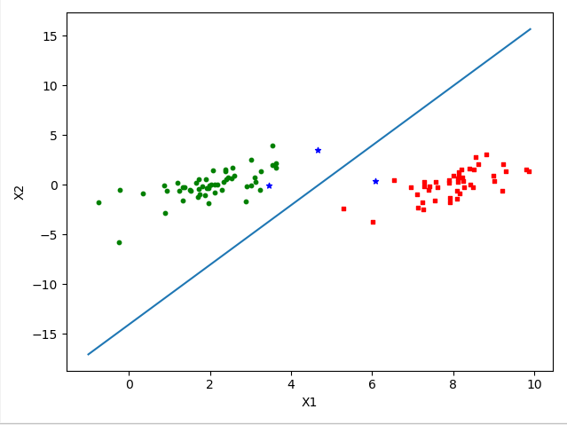

Figure 3-10 Decision boundary for SVM-SMO1

实验9：SVM实验2-完整SMO[1] 
---------------------------

### 实验内容

实验内容和上述实验相同。

### 算法概述

这里利用完整的SMO算法，上述算法只是简单的循环指定次数，当数据量大的时候计算量会非常大。因此，这里带来了几个改动：

1.  外层选择i时，不是简单的循环找到不符合KKT条件的，而是在循环整个数据集和循环0\<ai\<C的部分来回进行，而且不是一定在没有改动的情况下循环指定次数才跳出循环，而是有两个判定条件：要么是循环完指定次数（不一定每次循环都不改变a）；要么是循环完一次完成数据集且没有a改变。

2.  内层循环选择j时，为了使每次改变的步长最大，需要建立一个E（预测值和真实值差值）的缓存，每次在缓存中找到使abs(Ek-Ei)最大的k值，选择为j，如果缓存中还没有数据，就像从前一样随机选择。

3.  在循环内部基本和之前一样，只是在更新完ai和aj时要更新缓存值。

4.  通过以上改动，收敛速度显著提升。可通过改C的值去使分隔效果发生变化，C代表最小化ε的权重，当C变大时，会使分隔效果变好，但是模型复杂度会上升。

5.  核心代码略。

### 实验结果

如图3-11，可以发现支持变量显著增多，因为它覆盖了完整数据集。

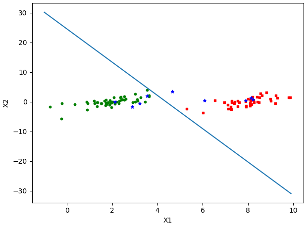

Figure 3-11 Decision boundary for SVM-SMO2

实验10：SVM实验3-运用核函数处理非线性可分数据集[1] 
---------------------------------------------------

### 实验内容

前两个SVM只能处理线性形式，当数据非线性可分，就需要把特征映射到更高维的空间，再用线性方法处理。因为计算映射函数不好定义而且映射函数的内积计算量很大，这里用核函数直接代替该内积。这里用非线性数据集进行测试。

### 算法概述

这里用的核函数是径向基核函数的高斯版本，具体公式为：

(3-14)

把完整SMO中所有的内积计算替换为K(x,y)即是核函数版本，可以处理非线性数据集。

初始化核函数的代码：

def kernelTrans(X,A,kTup):

m,n=X.shape

K=np.mat(np.zeros((m,1)))

if kTup[0]=='lin':

K=X\*A.T

elif kTup[0]=='rbf':

for j in range(m):

deltaRow=X[j]-A

K[j]=deltaRow\*deltaRow.T

K=np.exp(K/(-1\*kTup[1]\*\*2))

else:

>   raise NameError('Houston We Have a Problem--That Kernel is not recognized')

return K

### 实验结果

如图3-12，蓝色星标为支持向量，即它们对应
的ai\>0，即ti\*gi\<=1，由它们来对分隔平面的搭建起作用，由它们来分隔两个部分。

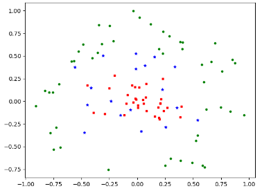

Figure 3-12 Decision boundary for SVM-kernelSMO

在训练集上和测试集上分别得到错误率：

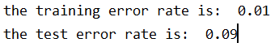

Figure 3-13 ErrorRate

实验11：区块链溯源文件的解析 
-----------------------------

### 实验内容

输入是比特币的目标coin溯源记录，封装成一个个json，包括一系列的交易，即交易树。从中得到到交易所的coin，和未到的coin。

### 算法概述

因为交易过程中会加入混币，因此需要把混币排出。已经到交易所的就是type
=’changes’。未到交易所的分两部分：一是其余叶子结点，二是交易的其中一些Output没有被后续引用。为了去除混币，为每个tx递归的新建一个目标金额属性和混币所占比例的属性。最后将到交易所的和未到交易所的都乘上比例得到最后的value。

### 实验结果

如图3-14。这是某个json的解析结果，sumcoin是目标金额，catchCoin是去除混币后的捕获金额。Noncatthcoin是未到交易所的。targetFee是目标金额花费的手续费总额。

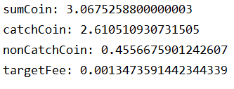

Figure 3-14 Bitcoin transaction data analysis

实验12：学习Go语言——搭建一个多功能匹配器[4]
-------------------------------------------

### 实验内容

输入字符串，在指定json文件提供的一些数据源网站中，获取网页上的xml文件，并给指定标签中的内容匹配字符串。

### 实验方法

架构如图3-13。

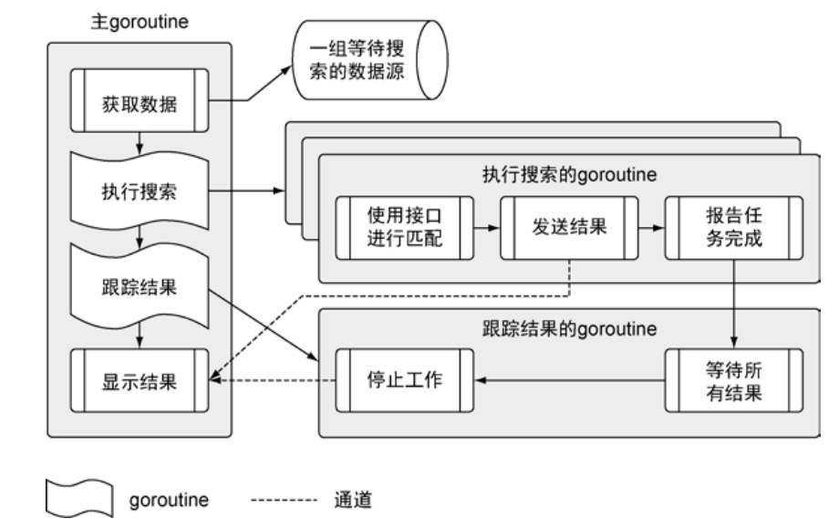

Figure 3-13 Program architecture flow chart

为每个数据源找到对应的已经实现了接口matcher，这些matcher都实现了search方法。并为每个数据源开一个goroutine进行搜索，并传到事先写好的通道中，当通道中送入值，值会通过通道到达主goroutine，此时激活display()，打印通道内容。再开一个监控是否完成的goroutine，维护一个waitGroup，每有一个goroutine结束，就给它减一。当它等0时，通道关闭，display()函数也随之执行结束，程序返回。

### 实验结果

如图3-14，输入正则表达式re=\`\\bstory\\b \`的输出结果。

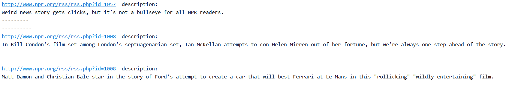

Figure 3-14 Matching results

实验13：学习beego框架
---------------------

### 实验内容

输入用户名，触发onkeyup事件，通过Ajax发送异步请求到beego-Controller层实时从数据库获取密码信息。

### 实验方法

主要代码：

Ajax:

xmlhttp.onreadystatechange=function()

{

if (xmlhttp.readyState==4 && xmlhttp.status==200)

{

document.getElementById("txtHint").innerHTML=xmlhttp.responseText;

}

}

xmlhttp.open("POST","/success/Ajax?q="+str,true);

xmlhttp.setRequestHeader("Content-type","application/x-www-form-urlencoded");

xmlhttp.send(); }

Controller:

func (c \*IndexController)GetAjaxStr(){

username:=c.GetString("q")

o:=orm.NewOrm()

user:=models.User{Name:username}

err:=o.Read(&user,"Name")

result:="找不到用户名"

if err!=orm.ErrNoRows{

result=user.Pwd

}

c.Ctx.WriteString(result)}

### 实验结果

如图3-15。

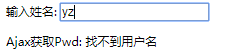

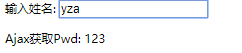

Figure 3-15 Search results

实验14：beego调用flaskAPI完成报表模块
-------------------------------------

### 实验内容

利用beego请求flask，在Python中处理json文件返回处理好的Json，并在beego前端通过报表显示。

### 实验方法

核心代码：

app = Flask(__name__)

\@app.route('/')

def index():

file_name = request.args.get('file')

return str(json.dumps(JsonProcess(file_name)))

if \__name__=='__main__':

app.run(host='127.0.0.1')

resp,err:=http.Get("http://127.0.0.1:5000/?file="+file)

if err!=nil{

beego.Info("GetAPI错误:",err)

c.Redirect("/report",302)

}

body,err:=ioutil.ReadAll(resp.Body)

c.Ctx.WriteString(string(body))

###  实验结果

如图3-16。

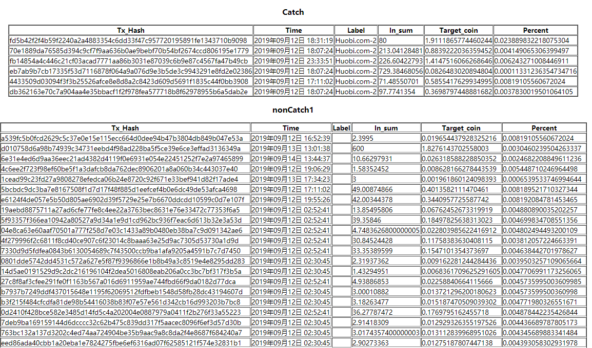

Figure 3-16 Report Form

致 谢
=====

References（参考文献）
======================

1.  蒋勇，文延，嘉文著.区块链技术丛书 白话区块链[M].北京：机械工业出版社.2017.

2.  Harrington P. 机器学习实战[J]. 人民邮电出版社, 北京, 2013.

3.  李航. 统计学习方法[J]. 2012.

4.  Narayanan A, Bonneau J, Felten E, et al. Bitcoin and cryptocurrency
    technologies: a comprehensive introduction[M]. Princeton University Press,
    2016.

5.  William Kennedy, Brian Ketelsen, Erik St Martin. Go in Action[M]. 2015.
